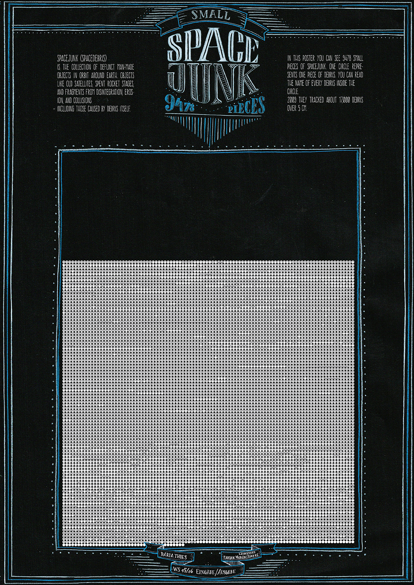
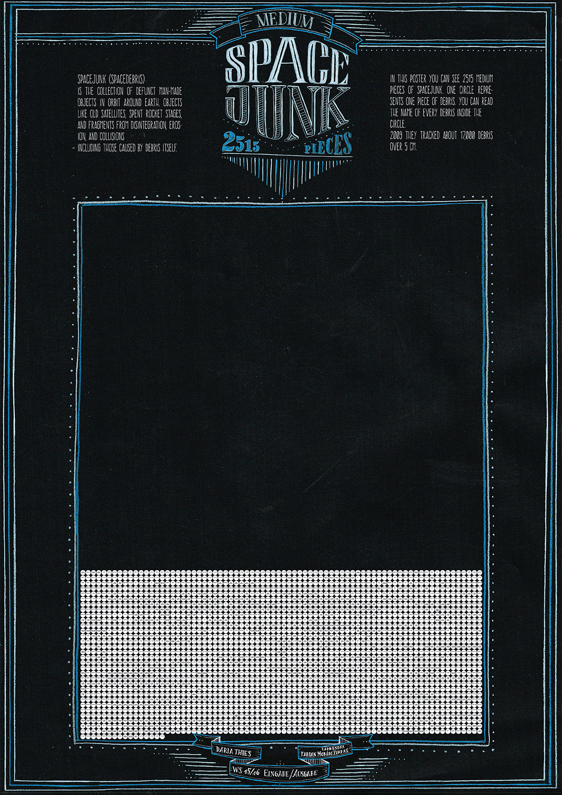
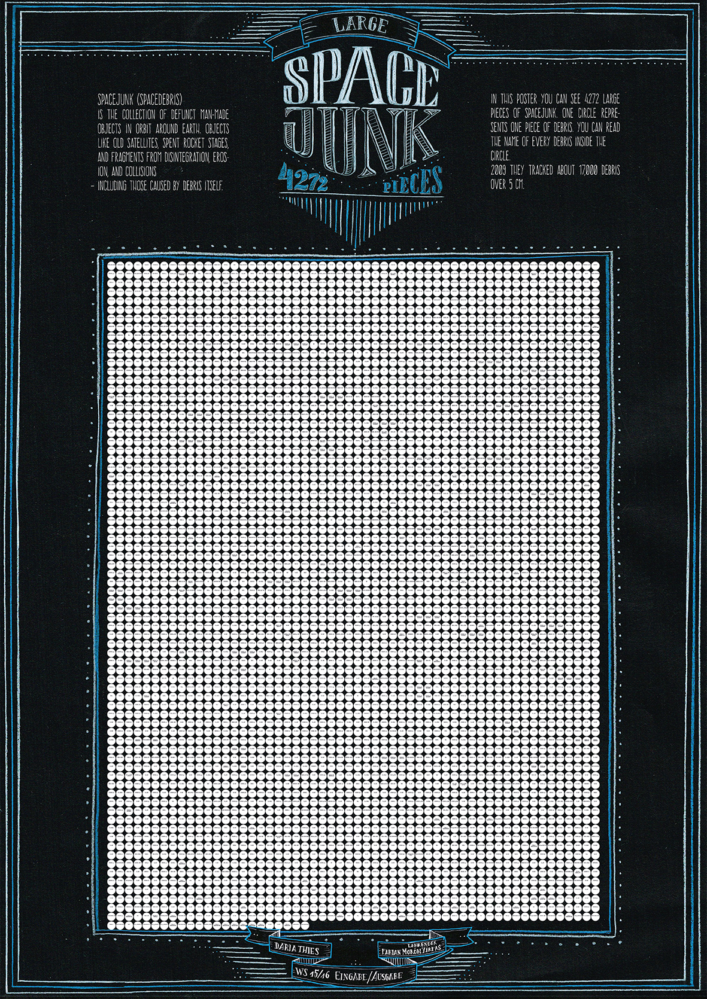

# Spacejunk
Infographic Posters about spacejunk

The ISS is rounding the world 15,65 times per day. But the space station is not the only object wich is rotation around the earth. About 20.000 pieces of space junk are located in the earth orbit. The ISS needs to know these objects to avoid them. 
As there are so many pieces in different sizes hovering around the world, I thought it would be interesting to visualize them. I collected all the data about space junk and decided to show there difference in size and their amount in this infographic. I divided them in small, medium and large Pieces and created three posters out of this data. 
Every space junk piece is represented by a white circle and the name of the piece is written inside. To count and name all the pieces I used an Indesign scripting tool named Basil.js.

At the end I designed three posters. Each poster shows space junk in a different size (small, medium and large). If you have the three posters together you can compare the amount of space junk really well and have a nice overview, how many pieces of trash are sourrounding our planet everyday and night.
Recycling and a responsible handle with our trash is more urgent then ever, even in space!

